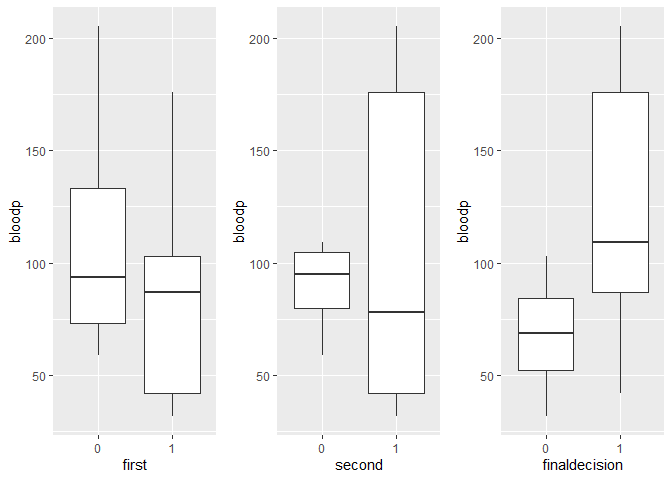
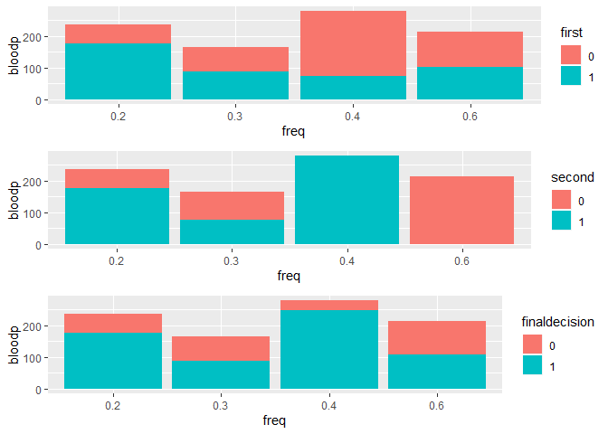

R Programming - Programming structure in R
================

"The following data was collected by the local hospital. This data set contains 5 variables based on observation of 8 patients. In addition to the measurements of the patients checking in to the hospital that night, this data provides the patients' histories regarding the frequency of their visits to the hospital in the last 12 months. This data displays the measurement of blood pressure, first assessment by general doctor (bad=1, good =0) titled "first," the second assessment by external doctor (called "second"), and the last row provides the head of the emergency unit's decision regarding immediate care for the patient based on the values 0 or 1 (low = 0, high =1)."

First we created a dataframe and cleaned it.

``` r
freq = c(0.6,0.3,0.4,0.4,0.2,0.6,0.3,0.4,0.9,0.2)
bloodp = c(103,87,32,42,59,109,78,205,135,176)
first = c(1,1,1,1,0,0,0,0,NA,1)
second = c(0,0,1,1,0,0,1,1,1,1)
finaldecision = c(0,1,0,1,0,1,0,1,1,1)

df = data.frame(freq,bloodp, first, second, finaldecision)
df = na.omit(df)
```

Next we changed our data to factors and then created boxplots.

``` r
df$first <- as.factor(df$first)
df$second <- as.factor(df$second)
df$finaldecision <- as.factor(df$finaldecision)

box1 = ggplot(df, aes(first, bloodp, color = freq))+geom_boxplot()
box2 = ggplot(df, aes(second, bloodp))+geom_boxplot()
box3 = ggplot(df, aes(finaldecision, bloodp))+geom_boxplot()

grid.arrange(box1,box2,box3, ncol = 3)
```



And bar plots.

``` r
df$freq = as.factor(df$freq)
bar1 = ggplot(df, aes(freq, bloodp, fill = first))+geom_bar(stat = "identity")

bar2 = ggplot(df, aes(freq, bloodp, fill = second))+geom_bar(stat = "identity")

bar3 = ggplot(df, aes(freq, bloodp, fill = finaldecision))+geom_bar(stat = "identity")


grid.arrange(bar1, bar2, bar3)
```


